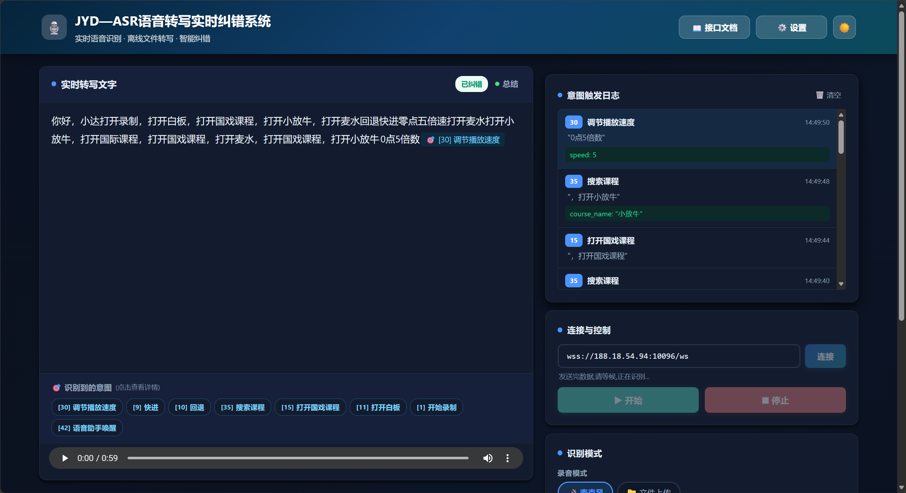
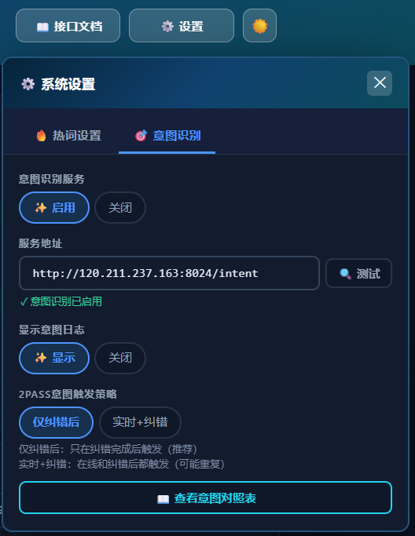
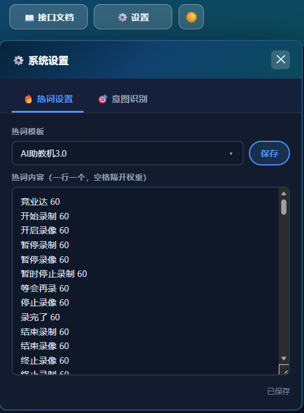
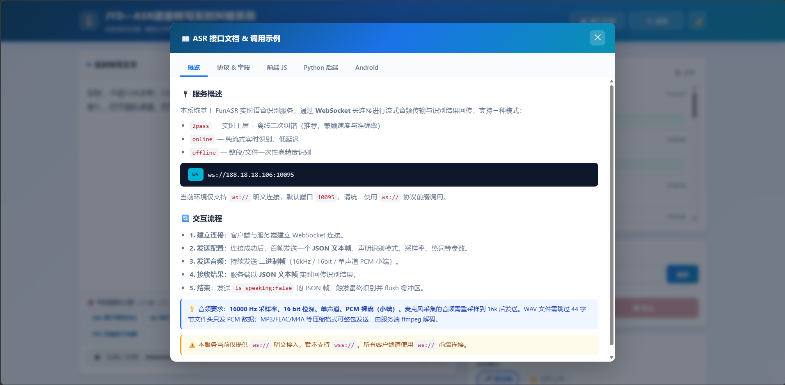

# JYD—ASR语音转写实时纠错系统

<div align="center">



**实时语音识别 · 离线文件转写 · 智能纠错 · 意图识别**

[](LICENSE)
[](https://www.python.org/)
[](https://github.com/alibaba-damo-academy/FunASR)

</div>

---

## 📋 目录

- [项目简介](#项目简介)
- [核心功能](#核心功能)
- [技术架构](#技术架构)
- [快速开始](#快速开始)
- [功能详解](#功能详解)
- [项目结构](#项目结构)
- [配置说明](#配置说明)
- [API文档](#api文档)
- [常见问题](#常见问题)
- [贡献指南](#贡献指南)

---

## 🎯 项目简介

JYD—ASR语音转写实时纠错系统是一个集成了**实时语音识别**、**离线文件转写**、**智能纠错**、**意图识别**和**AI摘要**等功能的综合性语音处理平台。系统基于阿里开源的 FunASR 引擎，提供高精度的中文语音识别服务，并通过自研的意图识别模块实现智能语音交互。

### 适用场景

- 📝 **会议记录**: 实时转写会议内容，自动生成纪要
- 🎓 **在线教育**: 课堂录音转文字，支持视频回放字幕
- 🏥 **医疗场景**: 病历录入、诊疗记录语音转写
- 📞 **客服系统**: 通话记录转写分析，意图识别
- 🎤 **采访记录**: 采访音频快速转写，支持热词定制

---

## ✨ 核心功能

### 1. 🎤 实时语音识别

- **三种ASR模式**
  - `2pass`: 实时识别 + 离线纠错，兼顾速度与精度
  - `online`: 纯在线模式，低延迟实时识别
  - `offline`: 离线模式，高精度转写

- **麦克风录音**
  - 支持浏览器原生麦克风采集
  - 实时音频流传输（WebSocket）
  - 边说边显示，即时反馈

- **智能纠错特效**
  - 实时显示纠错过程
  - 高亮标注变化文字
  - 动态徽章脉冲提示

### 2. 📁 离线文件转写

- **多格式支持**
  - 音频格式: WAV / MP3 / FLAC / AAC / OGG
  - 拖拽上传或点击选择
  - 文件信息预览

- **文件处理**
  - 独立转写结果展示
  - 音频播放器预览
  - 支持逆文本标准化（ITN）

### 3. 🎯 意图识别服务

系统集成了强大的意图识别功能，可自动识别用户语音指令中的操作意图（43+种意图类型）。

<div align="center">



*意图识别配置与日志展示*

</div>

#### 支持的意图类别

**录制控制** (Intent 1-4)
- 开始/暂停/结束/继续录制

**回放控制** (Intent 5-10)
- 打开/关闭回放、播放控制、快进回退

**白板批注** (Intent 11-13)
- 白板操作、批注管理

**视频操作** (Intent 20-30)
- 视频选择、时间跳转、速度调节

**课程管理** (Intent 33-41)
- 课程搜索、剧种筛选、台词跳转

详细配置请参考: [意图识别功能说明](./backend/jyd_intent/意图识别功能说明.md)

### 4. 🔤 热词定制

<div align="center">



*热词模板管理与配置*

</div>

- **热词模板管理**
  - 预设多个热词模板
  - 模板快速切换
  - 热词增删改操作

- **热词实时生效**
  - 专业术语识别增强
  - 人名地名优化
  - 行业词汇定制

### 5. 🤖 AI智能摘要

- **一键总结**: 点击"总结"按钮智能生成摘要
- **结构化输出**: Markdown格式，支持复制导出
- **上下文理解**: 基于全文内容提取关键信息

### 6. 🌓 深色模式

- 自动跟随系统主题
- 手动切换深色/浅色模式
- 全局配色优化，护眼舒适

---

## 🏗️ 技术架构

### 前端技术栈

- **纯原生开发**: HTML5 + CSS3 + JavaScript (ES6+)
- **WebSocket**: 实时双向通信
- **Web Audio API**: 音频采集与处理
- **localStorage**: 本地配置持久化

### 后端技术栈

#### 语音识别引擎
- **FunASR**: 阿里达摩院开源的语音识别框架
- **WebSocket Server**: 实时音频流处理
- **模型**: Paraformer/SenseVoice 系列模型

#### 意图识别服务
- **Flask**: 轻量级Web框架
- **Python 3.11+**: 核心业务逻辑
- **正则匹配 + LLM推理**: 混合意图识别策略
- **Dify工作流**: 大模型调用

### 通信协议

- **WebSocket**: `wss://` 加密连接
- **HTTP/HTTPS**: RESTful API
- **JSON**: 数据交换格式

---

## 🚀 快速开始

### 环境要求

- Python 3.11+
- Node.js 14+ (可选，用于开发)
- 现代浏览器 (Chrome 90+ / Firefox 88+ / Edge 90+)

### 1. 克隆项目

```bash
git clone https://github.com/EakAip/jyd-asr-correction.git
cd jyd-asr-correction
```

### 2. 启动 FunASR 服务

```bash
# 进入 FunASR 目录
cd backend/FunASR

# 安装依赖
pip install -r requirements.txt

# 启动 WebSocket 服务 (需根据实际配置)
# 默认地址: wss://188.18.54.94:10096/ws
```

### 3. 启动意图识别服务（可选）

```bash
# 进入意图识别目录
cd backend/jyd_intent

# 安装依赖
pip install flask flask-cors requests

# 启动服务
python jyd_intentV1.py

# 服务地址: http://localhost:8024/intent
```

### 4. 打开前端界面

```bash
# 直接用浏览器打开
cd frontend
# 双击 index.html 或使用本地服务器
python -m http.server 8080
```

访问: `http://localhost:8080/index.html`

---

## 📖 功能详解

### 实时转写流程

1. **连接服务器**
   - 输入 WebSocket 地址
   - 点击"连接"按钮
   - 等待连接成功提示

2. **选择识别模式**
   - 录音模式: 麦克风 / 文件上传
   - ASR模式: 2pass / online / offline

3. **配置参数**
   - 逆文本标准化（ITN）: 是/否
   - 纠错特效: 开启/关闭
   - 热词模板: 选择或自定义

4. **开始识别**
   - 点击"▶ 开始"按钮
   - 对着麦克风说话或上传音频文件
   - 实时查看转写结果

5. **查看结果**
   - 转写文本显示在左侧面板
   - 意图标签显示在文字后（如已启用）
   - 点击"总结"生成AI摘要

### 意图识别配置

详细配置步骤请参考:
- [意图识别功能说明](./backend/jyd_intent/意图识别功能说明.md)
- [意图识别快速开始](./backend/jyd_intent/意图识别快速开始.md)

**快速配置**:
1. 在右侧"识别设置"中找到"意图识别服务"
2. 输入服务地址: `http://188.18.18.169:8024/intent`
3. 点击"🔍 测试连接"验证服务
4. 选择"✨ 启用"开启意图识别
5. 开始说话，查看意图标签

---

## 📁 项目结构

```
jyd-asr-correction/
├── frontend/                    # 前端文件
│   ├── index.html              # 主页面
│   ├── main.js                 # 核心业务逻辑
│   ├── wsconnecter.js          # WebSocket 连接管理
│   ├── recorder-core.js        # 录音器核心
│   ├── wav.js                  # WAV 编码器
│   └── pcm.js                  # PCM 编码器
│
├── backend/                     # 后端服务
│   ├── jyd_intent/             # 意图识别服务
│   │   ├── jyd_intentV1.py     # 服务主程序
│   │   ├── 意图识别功能说明.md   # 功能文档
│   │   └── 意图识别快速开始.md   # 快速指南
│   │
│   └── FunASR/                 # 语音识别引擎
│       ├── funasr/             # 核心库
│       ├── examples/           # 示例代码
│       ├── model_zoo/          # 模型仓库
│       └── runtime/            # 运行时环境
│
├── docs/                        # 文档资源
│   └── images/                 # 示例图片
│       ├── image.png           # 主界面截图
│       ├── hotword.png         # 热词配置截图
│       ├── intent.png          # 意图识别截图
│       └── api_docs.png        # API文档截图
│
└── README.md                    # 项目说明（本文件）
```

---

## ⚙️ 配置说明

### WebSocket 服务配置

```javascript
// 默认地址
wss://188.18.54.94:10096/ws

// 配置项
{
  "mode": "2pass",           // ASR模式
  "use_itn": false,          // 是否启用ITN
  "chunk_size": [5, 10, 5],  // 音频块大小
  "wav_name": "h5",          // WAV文件名前缀
  "is_speaking": true,       // 是否正在说话
  "hotwords": ""             // 热词列表
}
```

### 意图识别服务配置

```python
# 服务地址
http://localhost:8024/intent

# 请求格式
POST /intent
Content-Type: application/json
{
  "text": "打开白板"
}

# 响应格式
{
  "code": 200,
  "message": "success",
  "data": {
    "intent_id": 11,
    "latency_ms": 125.5
  }
}
```

### 热词配置格式

```json
{
  "default": "阿里巴巴 20\n达摩院 30",
  "医疗": "糖尿病 30\n高血压 30\n心脏病 30",
  "教育": "数学 20\n语文 20\n英语 20"
}
```

---

## 📡 API文档

<div align="center">



*内置API文档与调用示例*

</div>

### 1. WebSocket 语音识别

**连接地址**: `wss://host:port/ws`

**消息格式** (JSON):

```json
{
  "mode": "2pass",
  "chunk_size": [5, 10, 5],
  "wav_name": "session_id",
  "is_speaking": true,
  "chunk_interval": 10,
  "itn": false,
  "hotwords": "专业术语 30"
}
```

**返回格式**:

```json
{
  "mode": "2pass-online",
  "text": "实时识别结果",
  "is_final": false,
  "timestamp": "2024-01-01 12:00:00"
}
```

### 2. 意图识别 API

**接口地址**: `POST /intent`

**请求参数**:

| 参数 | 类型 | 必填 | 说明 |
|------|------|------|------|
| text | string | 是 | 待识别的文本 |

**响应参数**:

| 参数 | 类型 | 说明 |
|------|------|------|
| code | int | 状态码 (200=成功) |
| message | string | 响应消息 |
| data | object | 意图数据 |
| data.intent_id | int | 意图ID (0-43) |
| data.latency_ms | float | 识别延迟(毫秒) |

**示例**:

```bash
curl -X POST http://188.18.18.169:8024/intent \
  -H "Content-Type: application/json" \
  -d '{"text":"打开白板"}'
```

完整API文档请访问界面右上角"📖 接口文档"按钮查看。

---

## ❓ 常见问题

### Q1: WebSocket 连接失败

**可能原因**:
- 服务未启动
- 地址配置错误
- 网络不通
- 防火墙阻止

**解决方法**:
1. 检查服务状态
2. 验证地址格式 (`wss://` 或 `ws://`)
3. 测试网络连通性
4. 检查防火墙设置

### Q2: 麦克风无法使用

**可能原因**:
- 浏览器未授权麦克风权限
- HTTPS环境要求（Chrome 安全策略）
- 麦克风被其他程序占用

**解决方法**:
1. 点击浏览器地址栏左侧图标，允许麦克风权限
2. 使用 `https://` 或 `localhost`
3. 关闭其他占用麦克风的程序
4. 检查操作系统麦克风设置

### Q3: 意图识别服务连接失败

**解决方法**:
1. 确认服务已启动: `ps aux | grep jyd_intentV1.py`
2. 测试服务连通性: `curl http://localhost:8024/health`
3. 检查跨域配置（CORS）
4. 查看服务日志: `tail -f logs/8024.log`

详细故障排查请参考: [意图识别功能说明](./backend/jyd_intent/意图识别功能说明.md#故障排查)

### Q4: 识别精度不高

**优化建议**:
1. 使用 `2pass` 或 `offline` 模式
2. 配置专业领域热词
3. 保持安静的录音环境
4. 使用高质量麦克风
5. 开启逆文本标准化（ITN）

### Q5: 如何导出转写结果

**方法一**: 直接复制
- 选中转写文本，Ctrl+C 复制

**方法二**: 使用总结功能
- 点击"总结"按钮生成摘要
- 点击"📋 复制"按钮复制内容

**方法三**: 浏览器控制台
```javascript
// 获取所有转写文本
document.getElementById('transcriptionBody').innerText
```

---

## 🤝 贡献指南

欢迎贡献代码、报告问题或提出新功能建议！

### 如何贡献

1. Fork 本仓库
2. 创建特性分支 (`git checkout -b feature/AmazingFeature`)
3. 提交更改 (`git commit -m 'Add some AmazingFeature'`)
4. 推送到分支 (`git push origin feature/AmazingFeature`)
5. 开启 Pull Request

### 开发规范

- 遵循现有代码风格
- 添加必要的注释
- 更新相关文档
- 测试新功能

---

## 📄 开源协议

本项目采用 MIT 协议开源 - 详见 [LICENSE](LICENSE) 文件

---

## 🙏 致谢

- [FunASR](https://github.com/alibaba-damo-academy/FunASR) - 阿里达摩院开源的语音识别框架
- [Recorder](https://github.com/xiangyuecn/Recorder) - 浏览器录音库参考
- 所有贡献者和使用者

---

## 📧 联系方式

- **项目地址**: [https://github.com/EakAip/jyd-asr-correction](https://github.com/EakAip/jyd-asr-correction)
- **问题反馈**: [Issues](https://github.com/EakAip/jyd-asr-correction/issues)
- **开发者**: EakAip

---

<div align="center">

**如果这个项目对你有帮助，请给一个 ⭐ Star 支持一下！**

Made with ❤️ by EakAip

</div>
